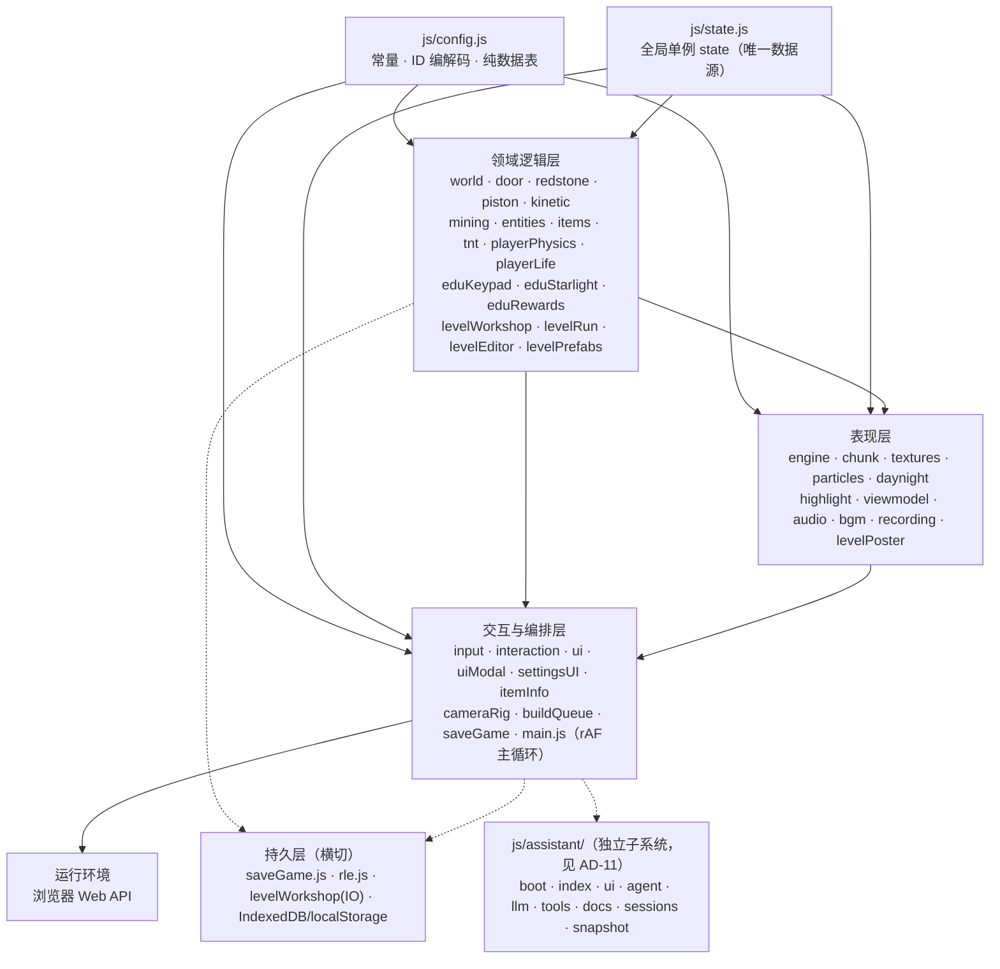

# Architecture Spine — mcweb（我的世界 - 网页复刻版）

## Design Paradigm

**模块化单体（Modular Monolith）× 单一可变状态仓库 × 纯数据派生。**

无框架、无打包器的原生 ES Modules 单页应用：一块全屏 Three.js 画布 + HTML DOM 浮层；全部可变游戏状态挂在 `js/state.js` 导出的全局单例 `state` 上，各模块直接 import 并读写——**无事件总线、无不可变数据、无双向绑定**。常量与纯数据表集中在 `js/config.js`；转速/应力/机器进度/信号电平等**派生态永不入存档**，由事件触发的全量重算从方块 ID 现算（读档 `initXxx()` 重建）。这条范式由四个已验证的有状态方块族（door/redstone/piston/kinetic）共用同一骨架背书。

分层与依赖方向（`→` 表示「允许依赖」；反向依赖与跨层跳跃是违规）：



**纯逻辑模块禁 three/DOM import**（levelWorkshop / levelPrefabs / rle / levelRun 纯函数段 / config 等必须 Node 直测），浏览器专用路径一律动态 `import()` 惰性加载——这是「同一份模块既跑在浏览器又跑在 node:test」的承重规则。

## Invariants & Rules

### AD-1 — 纯静态零构建形态（产品红线）[ADOPTED]

- **Binds:** all（全平台）；NFR-1、NFR-9
- **Prevents:** 引入构建工具/包管理器/npm 依赖，导致「双击服务器即可跑」失效、纯静态托管失效、submodule+rsync 发版链失效、无构建哈希的缓存策略失效
- **Rule:** 一切前端代码保持原生 ES Modules 直连；第三方库仅允许经 CDN 引入（现状只有 Three.js 0.160.0/unpkg）；禁止任何构建步骤与 node_modules。入口 HTML 固定为 `index.html`，重命名必须同步 `server.py` 与 `server-rust/` 的 `ENTRY_HTML` 常量。不要引入 Web 字体/CSS 框架/图标库（视觉零依赖同理）。

### AD-2 — 单例 state 是唯一数据源 [ADOPTED]

- **Binds:** all
- **Prevents:** 各模块自建状态副本或私有事件通道，导致模式守卫漏判、双事实源漂移、切世界/进关后残留脏状态
- **Rule:** 所有跨模块可变游戏状态一律挂 `js/state.js` 导出的 `state` 对象（含 `levelRun`/`levelEdit`/`buildPaused`/`saveSlot`/`worldSeed` 等模式字段）；新状态先进 state.js 登记，再被各模块 import 读写；禁止发明替代的状态管理层。

### AD-3 — 常量与纯数据表集中在 config.js [ADOPTED]

- **Binds:** E1、E2；全部调参/配方/挖掘属性
- **Prevents:** 数值散落各模块造成「两处改一处漏」；配方与校验逻辑分叉
- **Rule:** 调参（物理/刷怪/饥饿/应力/WHEEL_RPM 等）、`RECIPES`/`KINETIC_RECIPES` 纯数据表、`BlockInfo`（hardness/tool/needsTool/drop/minTier/food）、工具档位（TOOL_TIER_*）、不满格道具的 outline 选取形状，只改 config.js；消费方（mining/craftRecipe/E 面板/itemInfo）自动同步，不得复制数值。

### AD-4 — 有状态方块：状态编进方块 ID，派生态不入存档 [ADOPTED]

- **Binds:** E1（红石/活塞/动力/物流/电梯）、E2（答题机/商人/矿石/星辉门/旗组）；流水线准绳 #1「存档格式零改动」
- **Prevents:** 任何波及存档结构的设计（新序列化格式、存档里出现派生态）；新方块只登记一半导致读档丢网格/丢交互
- **Rule:** 新有状态方块在 config.js 定义 ID 段常量与编解码纯函数（朝向/开合/变体直接编码进 ID，参照 DOOR_BASE/DUST_BASE/PISTON_BASE/SHAFT_BASE/KEYPAD_BASE 既有段位），转速/应力/进度/信号等派生态走运行时 Map，读档 `initXxx()` 重算。新道具/贴面方块必须**全套登记**：config BlockInfo + outline（不满格时）+ textures tile + chunk.js `isPropBlock`/`getPropMesh` + interaction `pickBlockItem`（缺 isPropBlock = 读档后道具网格消失，旗组批次实证）。
- **ID 段位表（新方块先查此表，空闲段以 config.js 现状为准）：** 0..62 基础方块；148..169 动力组；180..187 材料物品 + 188 出题笔；202..217 物流控制组；218..222 滑轮组；224..225 答题机；226 商人；228 识字矿石；229..231 旗组；232..233 星辉门。

### AD-5 — 事件触发全量重算的网络求解骨架 [ADOPTED]

- **Binds:** E1（FR-3~FR-6）；NFR-4
- **Prevents:** 为单个新元件发明增量同步机制造成信号/转速不一致；性能回归（1M 格扫描链每多一个分支都有 JIT 形态成本，L2 P01 实证 +1.2ms）
- **Rule:** 红石与动力照同一骨架：放置/破坏/红石边沿等**事件** → `updateXxxNetwork()` 全量重算 → 派生态落运行时 Map → 帧末聚合统一 rebuildChunk。解锁/答对翻转类变体回写必须走 `setBlockSafe + rebuildChunk + updateRedstoneNetwork`（照星辉门先例）——锁具与红石网络的耦合只此一条合法接线，不得绕过或另行通知。**redstone.js 的 else-if 链禁止延长**——新元件并入既有 `id >= CLUTCH_BASE` 短路分支内细分。保留已验证的局部守卫：仅投水才动力重算、朝向格 5×5×5 有红石元件才红石重算、滑轮平台跨格零重算、带边相位绝缘。全图重算是**已登记债务**（见「技术债」节），不是允许恶化的现状。

### AD-6 — AI 施工走渐进队列，切世界必清队 [ADOPTED]

- **Binds:** E6（FR-29）、E3（FR-19 W13）；助手建造
- **Prevents:** 批量建造一次性重建区块卡死主循环；旧世界没放完的方块写进新世界或关卡（幽灵建筑）
- **Rule:** 助手大批量建造只能经 `buildQueue.enqueueBuildOps` 分帧放置+按帧预算重建；`clearBuildQueue()` 是切槽/开新/进关的固定步骤（main.js 编排、levelRun.enterLevel 强制调用）。

### AD-7 — 存档版本化、RLE 压缩与存储分流 [ADOPTED]

- **Binds:** E1（FR-7）、E3（FR-18）；NFR-5
- **Prevents:** 世界扩容丢玩家改动；localStorage 5MB 配额被新数据挤爆；关卡卡与缩略图挤占存档槽
- **Rule:** 存档 v4：`dims` 字段记录世界尺寸，尺寸不符的老档自动迁移（存档种子按当前尺寸重生成地形 + 老区域逐格覆盖，玩家改动字节级保真——run_migrate.py 锁定）；方块 RLE 压缩（`js/rle.js` 零依赖，不可压缩回退 raw）；六槽 `mcweb.save.v1.slotN` + 轻量索引，旧单槽自动迁入槽 0。**新增持久数据一律优先 IndexedDB**（'mcweb-levels'，不可用/超限降级会话内 +sessionOnly 并明确提示）；localStorage 仅限既有 `mcweb.*` key 与 <100KB 小体积新增。
- **世界扩容的完整前置**（PRD §6 非目标背书）：再扩容前必须先偿还「种子+玩家改动差分存档」（债 2）与「元件索引」（债 1）；扩容动作本身只改 WORLD_WIDTH/DEPTH/HEIGHT，迁移由 v4 机制承接。

### AD-8 — 关卡卡契约 mcweb.level.v1 与坐标唯一换算点 [ADOPTED]

- **Binds:** E3、E4、E8~E10（lockType/rules 扩展）；FR-16~FR-21
- **Prevents:** 坐标换算散落各模块产生「同一把锁两套记账」；卡内题目引用题库导致版本漂移；schema 破坏性变更作废存量卡片
- **Rule:** 卡 schema 冻结**只增不改**；卡内一律局部坐标，`worldToLocal/localToWorld` 只在 `js/levelWorkshop.js` 实现，其他模块（levelRun/eduKeypad/eduStarlight/助手工具）一律经它换算；`state.levelRun.answers` 以局部坐标字符串为 key。嵌入固定偏移 `EMBED_OFFSET={80,4,80}`，区域上限 96×64×96，区域自动检测=旗∪锁∪门联合包围盒 +2 clamp。**题目全量拷贝**进卡（防题库漂移）；自拟题不回写公共题库。导出校验 `validateLevelCard`（双通过/选项查重/答案合法/BFS 可达性）是发布唯一闸门，草稿卡（meta.draft）豁免双通过、正式导出不豁免。

### AD-9 — 模式守卫与存档防线（闯关/编辑隔离）[ADOPTED]

- **Binds:** E3（FR-19/FR-22）；NFR-6；W01~W24 冻结清单
- **Prevents:** 知识锁被绕过（挖掘/放置/飞行/手开门绕锁）；闯关中任何存档通道写毁玩家槽位；限制逻辑渗漏进普通玩法
- **Rule:** 闯关/编辑的一切限制都是 `state.levelRun`/`state.levelEdit` 判定的**模式 guard**，playerPhysics 零改动，普通世界回归不受影响（W01 锁定）；被拒操作必须弹带 emoji 的理由文案，绝不静默。**存档防线 = saveGame() 入口闸**（`if (state.levelRun || state.levelEdit) return false`），覆盖 30s 自动存/pagehide/隐藏/手动保存四通道；任何新增写槽位通道必须经同一入口。**「唯一防线」类裁决必须穷举防线的失效前提**（W 批次 P0 教训：热重载快照通道绕过 levelRun 判定——修复=快照侧只落标记、恢复侧见标记放弃）。

### AD-10 — uiModal 是指针锁与互斥模态的唯一管理者 [ADOPTED]

- **Binds:** 全部 UI 面；E3/E5/E7 的浮层
- **Prevents:** 多处调用 requestPointerLock 互相抢鼠标；新浮层破坏互斥语义与 z-index 阶梯；Esc/Q 行为分叉
- **Rule:** 全游戏只有 `js/uiModal.js` 调用 `requestPointerLock/exitPointerLock`。互斥状态机 `title ⇄ playing ⇄ pause/inventory/settings/dead/result`；「游戏照跑、指针让位」的非暂停浮层必须走**登记的标志位**（`recordingControlsOpen`/`levelExportOpen`/`prefabPickerOpen`/`authorPanelOpen`），新增浮层先归类（互斥模态/非暂停浮层/独立侧栏）再动手，并插入既有 z 阶梯，不得另起魔法数。

### AD-11 — AI 助手与游戏本体解耦 [ADOPTED]

- **Binds:** E6；FR-29~FR-33
- **Prevents:** 助手故障拖垮游戏启动；LLM 配置进游戏存档；热重载把临时世界写穿玩家存档
- **Rule:** `js/assistant/boot.js` 零依赖引导（最早捕获错误入 sessionStorage，游戏改坏仍能显示错误浮层）；助手是**不阻塞游戏的独立侧栏**——不进 uiModal 状态机、游戏键照常；配置与会话存 localStorage，浏览器直连用户自配的 OpenAI 兼容上游（Key 不出本机，HTTPS 站点上游必须 HTTPS）。热重载经 `snapshot.js` RLE 快照保存/恢复世界与玩家；闯关/编辑激活时快照只落 `levelRunWasActive` 标记，恢复侧强制回关卡列表（W22）。苏格拉底红线：提示词绝不代答，考核锁（rules.lockAIHelp=false）拒答。

### AD-12 — 确定性是三种机制的共同地基 [ADOPTED]

- **Binds:** E1（世界生成）、E4（官方关卡）、E2（教育锁抽题）；NFR-8
- **Prevents:** 地形迁移不可复现；官方关卡手改 JSON 与生成器分叉；抽题结果不确定导致「题库即状态」的存档膨胀
- **Rule:** ① 世界生成由 `worldSeed` 驱动（种子混入全部噪声、种子进存档、地形公式只依赖坐标与种子——这是 v4 迁移成立的根基）；② 官方关卡由 `tools/gen_builtin_levels.mjs` 确定性输出（模块注册制：`tools/builtin_levels/level_*.mjs` 一关一文件 + `_lib.mjs` 工具与 `buildCard` 统一 AUTHOR/CREATED/lockedSequenceCheck；created 固定时间戳；**禁止手改 JSON，改设计重跑生成器**）；③ 教育锁按格子哈希**同格同题**确定性抽题（题不进存档，卡内题目全量拷贝兜底）。

### AD-13 — 双服务器实现等价 [ADOPTED]

- **Binds:** 基础设施；NFR-1
- **Prevents:** 前端依赖仅存在于单一服务器实现的能力（本地能跑、公网断；或反之）；两实现接口漂移
- **Rule:** `server.py`（Python 标准库）与 `server-rust/`（Rust 标准库零 crate）对外接口/JSON/SSE 格式完全一致，前端与助手零改动可切换；新增 `/api/*` 路由必须双实现同步，或明确标注「仅本机开发功能」（现状唯一例外：`/codex` 反代只在 server.py）。本地静态响应 `Cache-Control: no-store`（防启发式缓存混载新旧 JS——2026-09-01 线上事故的修复）。curl 验收锚点：/ 字节一致、.js MIME、/api/files、SSE、304。

### AD-14 — 部署与缓存红线 [ADOPTED]

- **Binds:** 基础设施；NFR-1、NFR-2、NFR-3
- **Prevents:** 写文件接口裸暴露公网（POST /api/file = 服务器任意源码写入）；发版后用户拿到旧 JS；任何遥测/后端渗透进纯静态形态
- **Rule:** 公网部署（apps.yltech.store/mcweb/）= 主站仓 submodule `apps/mcweb` + CNB CI rsync；更新线上 = 本仓库 push → 主站仓 `git submodule update --remote apps/mcweb` + commit + push。缓存策略：HTML/JS/CSS = no-cache（ETag 命中 304），媒体资源 1 小时——站点无构建哈希，这是「发版即达」的唯一保证，不得回退。**公网必须 `--no-api`（Rust）或纯静态托管，POST /api/file 绝不裸暴露**（置于鉴权之后亦须评估）。零数据采集是架构红线：无账号、无上报、无 SDK；指标只端内 localStorage 聚合（FR-28），唯一允许的出数通道是家长页一键导出文件（FR-41，条件需求，仍无后端）。

```mermaid
graph LR
    DEV["开发机<br/>python3 server.py（含 /api/* 与 /codex）<br/>或 game-server（Rust，--no-api 可选）"]
    REPO["游戏仓库<br/>cnb.cool/yltechpublic/mcweb"]
    MAIN["yltech.store 主站仓<br/>submodule apps/mcweb"]
    CI["CNB CI：rsync apps/ → 服务器"]
    NGX["nginx<br/>HTML/JS/CSS no-cache（ETag 304）· 媒体 1h"]
    USER["家庭/课堂桌面浏览器<br/>apps.yltech.store/mcweb/"]
    LLM["用户自配 OpenAI 兼容上游<br/>（必须 HTTPS）"]
    DEV -->|commit + push| REPO
    REPO -->|submodule update --remote| MAIN
    MAIN -->|commit + push 触发| CI
    CI --> NGX
    NGX -->|静态资源| USER
    USER -.->|仅家长/教师配置后，浏览器直连| LLM
```



### AD-15 — 内容/代码接口契约化 [ADOPTED]

- **Binds:** E2（FR-10）、E4（FR-26）、E8~E10 扩展
- **Prevents:** 题库内容与加载引擎各自演化导致校验真空；并行开发代理互踩共享文件
- **Rule:** 题库内容与代码的唯一接口是 `docs/edu-quiz-banks-contract.md`，由 `tools/validate_banks.py` 全量校验执行（当前 597 题零违规；english/hanzi 含人工清洗，重跑提取脚本会覆盖——文件头有警告）；关卡模块 API 与卡片 schema 的唯一事实源是 `docs/edu-workshop-impl-contract.md`。新批次沿用「契约先行 + 校验脚本执行 + E2E 冻结清单只增不改」三角。extract/gen 类工具产出的手清洗文件重跑前必须核对文件头警告。

## Consistency Conventions

| Concern | Convention |
| --- | --- |
| 命名（文件/导出） | 模块文件小写驼峰 `js/xxx.js`；导出函数动词开头（tryPlaceDoor/updateRedstoneNetwork）；编码访问器 `xxxId(state)`/`isXxxId(id)`；E2E 用例编号 `<批次>-<层><序号>`（N=边界/S=存档/P=性能/L=泄漏/R=回归/E=功能，W=工坊、ED=编辑器、G0=修复门） |
| 命名（注释/提交） | 代码注释与提交信息使用中文；commit 独立可 revert、说明写验证方式（流水线准绳 #4） |
| 数据与格式 | 格式字符串冻结：`mcweb.level.v1`、`mcweb.save.v1.slotN`、`mcweb.edu.v1`、`mcweb.levels.v1`、IndexedDB `mcweb-levels`（v2 含 templates store）——品牌改名（FR-42）不触碰这些字符串；**新增 localStorage key 必须沿用 `mcweb.<域>.v<N>` 命名并在 AGENTS.md 登记**；方块 ID 段位分配先查 AD-4 段位表，图集 tile 分配先查 textures.js 现状（16×16，85 起空闲）；DOM id 契约（#level-list/#result-panel/#level-hud 等）以工坊契约为准 |
| 状态与横切 | 新浮层先归类再动手（AD-10）；新增持久数据优先 IndexedDB（AD-7）；守卫拒绝必带理由文案、诚实降级不阻塞玩法（题库缺→兜底题、贴图缺→程序化兜底、BGM 缺→静默、IndexedDB 缺→会话内，NFR-7）；新有状态方块照「config 编解码 → 高层逻辑模块（照 kinetic.js 骨架）→ chunk 道具网格 → interaction 路由」四步（流水线准绳 #5） |
| 性能 | 新增性能敏感分支先跑基线再定阈值（基线×1.2 规则）；现役门值见「技术债」节；无数字的性能门等于没有门 |
| 测试 | 纯逻辑模块 Node 直测（`tools/test_*.mjs`，node:test）；**新模块创建时先声明可测性边界：需 Node 直测者禁静态 import three/DOM/chunk，浏览器专用路径一律动态 `import()`**；行为回归走 CDP 注入 E2E（`tests/e2e/`，复用 lib.py 驱动库，禁止裸写 sleep）；每期上线前跑全套件回归（run_g0/regression/l1/l2/rec/migrate/elevator/filming/workshop + smoke_*，NFR-8） |

## Stack

| Name | Version |
| --- | --- |
| JavaScript（原生 ES Modules，无框架/无打包器） | ES2020+（现代桌面 Chrome 系为目标平台） |
| Three.js（CDN unpkg，唯一运行时第三方库） | 0.160.0 |
| HTML/CSS（唯一入口 index.html，内联 CSS + 模块注入样式） | — |
| 浏览器平台 API（WebGL / Pointer Lock / localStorage / IndexedDB / WebAudio / MediaRecorder / File API） | 现代桌面 Chrome 系 |
| server.py（本地/可选公网服务器：静态 + /api/* + /codex 反代） | Python 3 仅标准库 |
| server-rust/（等价服务器，公网 --no-api 模式） | Rust 仅标准库，零第三方 crate |
| 测试（node:test 工具测试 + 自研 CDP 注入式 E2E） | Python 3（E2E 驱动），node:test（纯逻辑） |

*版本为 2026-09-17 代码库现状追认；本形态锁死依赖升级面（CDN 单库），升级 Three.js 属常规维护，无需架构裁决。*

## Structural Seed

```text
game/
  index.html                  # 唯一入口：内联 CSS + HUD DOM + 加载 main.js 与 assistant/boot.js
  server.py / server-rust/    # 等价双实现：静态服务 + 本机开发 API（接口一致，见 AD-13）
  js/
    config.js  state.js       # 常量与 ID 编解码（AD-3/4）· 全局单例（AD-2）
    main.js                   # rAF 主循环，组装全部子系统
    world.js chunk.js engine.js textures.js particles.js daynight.js highlight.js viewmodel.js
    door.js redstone.js piston.js kinetic.js      # 有状态方块四族（AD-4/5 骨架）
    mining.js interaction.js input.js playerPhysics.js playerLife.js items.js entities.js tnt.js
    saveGame.js rle.js        # 六槽存档 v4 + 零依赖 RLE（AD-7）
    ui.js uiModal.js settingsUI.js itemInfo.js    # UI 与模态状态机（AD-10）
    cameraRig.js recording.js buildQueue.js bgm.js audio.js
    levelRun.js levelWorkshop.js levelEditor.js levelPrefabs.js levelPoster.js  # 关卡生态（AD-8/9）
    eduKeypad.js eduMerchant.js eduStarlight.js eduRewards.js   # 教育锁（AD-8/12/15）
    assistant/                # 独立子系统：boot(零依赖引导)·agent·llm·tools·docs·ui·sessions·snapshot（AD-11）
  assets/                     # textures(Cover 贴图)· audio(BGM/SFX)· levels(官方关卡卡)· edu(题库)
  tools/                      # gen_builtin_levels.mjs（注册制生成器）· validate_banks.py · test_*.mjs（Node 直测）
  tests/e2e/                  # CDP 注入式 E2E：lib.py 驱动 + run_* / smoke_* / extra_*（NFR-8 锚点）
  docs/                       # 批次方案与接口契约（AD-15 事实源）
```

**部署拓扑**见 AD-14 内嵌 mermaid 图；**运行形态**=单页应用，无服务端状态，全部玩家数据在浏览器端（localStorage 六槽 + IndexedDB 关卡库 + 助手配置），公网服务器只做静态分发。**运营面**：发布 = 批次 G3 四层验收全绿 → 人类批准（唯一必经人工点）→ push 上线；回退 = 提交链逐级 revert（org-plan §5.5，P1 连续 2 轮修复失败或波及存档格式即自动回退）；无 CI lint，质量门 = E2E 全套件 + Node 测试（NFR-8）。

## Capability → Architecture Map

| Capability / Area | Lives in | Governed by |
| --- | --- | --- |
| E1 沙盒基座（世界/生存线/四机关族/存档/录像） | world/mining/redstone/piston/kinetic/items/entities/saveGame/recording 等 | AD-2/3/4/5/6/7/12 |
| E2 教育内容锁（答题机/商人/矿石/星辉门/题库） | eduKeypad/eduMerchant/eduStarlight/eduRewards + assets/edu + validate_banks.py | AD-4/8/12/15 |
| E3 关卡工坊（出题/卡片/闯关/编辑器/组件/模板） | levelWorkshop/levelRun/levelEditor/levelPrefabs + 接线（interaction/input/uiModal/saveGame） | AD-8/9/10 |
| E4 内置官方关卡 | assets/levels + tools/gen_builtin_levels.mjs + tools/builtin_levels/ | AD-12/15 |
| E5 家长交接与端内指标 | eduRewards（进度/错题本/metrics）+ settingsUI「📚 学习」页 | AD-7（localStorage 限额）/AD-14（零采集） |
| E6 AI 助手（建造/热重载/三角色） | js/assistant/* + buildQueue + snapshot | AD-6/11 |
| E7 炫耀回路（宣传片/海报/缩略图） | recording（recOwner 所有权模型）/levelPoster | AD-10（非暂停浮层标志）/NFR-7（降级链） |
| 基础设施（双服务器/部署/缓存/E2E） | server.py/server-rust/主站 submodule/tests/e2e | AD-13/14 |

## 技术债与演进前置条件（PRD NFR 已登记，扩容/铺量前必还）

| # | 债务 | 触发条件（命中即立项） | 状态 |
| --- | --- | --- | --- |
| 1 | 红石/动力全图线性扫描 → **按写入口维护元件索引**（候选方案含 Web Worker 化重算，立项时比较） | 世界再扩容；或再叠加 redstone 扫描分支；或实测超门（L2 P01 的 else-if 形态回归 +1.2ms 已部分命中——「下次未必可消解」） | 登记（org-log L1/L2，PRD NFR-4） |
| 2 | localStorage 5MB 配额（6 槽×~880KB 逼近）→ **「存档种子+玩家改动差分」存档方案** | 512² 及以上世界扩容；或题库/关卡规模化铺量（FR-39）触及存储面 | 登记（PRD NFR-5；差分具体格式留批次 G1 定，见 Deferred） |
| 3 | 时钟电路全图重算 | 实测超现役门（L1 P02 记录值 mean 0.81~0.87 已挂观察） | 登记（org-log） |
| 4 | 百级带重算增量优化（keyOf 数值键方案已备） | A5(a) 场景实测 >2.5ms（曾 2.62~2.87，存量） | 登记（org-log） |
| 5 | 星辉门随卡导出的自包含（题库快照 or 进度哈希） | E8「预告关」类关卡立项时 | 登记（org-log W 批次） |
| 6 | 杂项：droppedItems/itemDrops 命名互换、教学卡片样式未抽公共表、run_encoder 两用例欠账 | 随相邻大改一并处理 | 登记（org-log / DESIGN OQ-D3） |

**现役性能门（新常态基线 ×1.2 规则，数值以 run_l1.py 脚本内注释为准）**：红石重算 ≤4.3ms / p95 ≤4.4ms；动力重算 ≤2.5ms；tick mean ≤0.58ms；电梯跨格期动力重算=0；工坊导入构建+首帧 ≤3000ms（W08，实测 ~240ms，待多轮实测后收紧）。

## 前瞻方向影响面评估（E8~E11，只标影响面，不展开设计）

| 方向 | 架构影响面 | 受约束的 AD |
| --- | --- | --- |
| E8 M3 作者框架化（新锁具/线索/机关） | config.js ID 段（224+ edu 段余量）；卡 schema `lockType`/rules **只增不改**；levelPrefabs 组件登记；出题笔作者面板题型扩展；生成器+E2E 冻结清单扩展；守卫文案矩阵。新锁具「四件套缺一不收」：作者面板 + 组件库 + itemInfo 说明 + 守卫文案 | AD-4/8/15 |
| E9 分学段延伸 | 低段=模板库（IndexedDB templates store）+组件参数化+UI token「大字模式」档位；高段=kineticStatusAt 数据复用为约束报表面板、约束进卡 rules（schema 只增）。playerPhysics/物理参数不动 | AD-3/7/8/10 |
| E10 题库与官方关卡规模化 | banks.json 多版本 key（契约 schema 不破坏）；validate_banks.py 管线扩展；生成器矩阵沿用注册制；关卡列表筛选/分组 UI（z 阶梯内）；IndexedDB N≤50 提示。题库不进存档（同格同题哈希），localStorage 压力不因此增长 | AD-7/12/15 |
| E11 命名与可观测性（条件） | FR-41 导出统计=纯前端聚合文件导出，无后端/无 SDK，与红线兼容，文件格式待定义；FR-42 改名=品牌资产替换（首屏文案/标签页/ENTRY_HTML 联动），**格式字符串与品牌解耦冻结不变** | AD-1/12/14 |

## 承重不变量速查（新代码检查单）

1. 不引入构建工具/包管理器/运行时第三方依赖（AD-1）。
2. 跨模块可变状态先进 `state.js`，不建私有状态仓（AD-2）。
3. 调参与配方只改 `config.js`，消费方不复制数值（AD-3）。
4. 新有状态方块：状态编进 ID + 派生态走运行时 Map + 全套登记（BlockInfo/outline/tile/isPropBlock/getPropMesh/pickBlockItem）（AD-4）。
5. redstone.js else-if 链禁延长；网络求解走事件→全量重算骨架（AD-5）。
6. 切世界/进关必 `clearBuildQueue()`（AD-6）。
7. 卡内一律局部坐标；world⇄local 只经 levelWorkshop（AD-8）。
8. 闯关/编辑限制一律模式 guard；写槽位只经 saveGame() 入口闸；唯一防线必须穷举失效前提（AD-9）。
9. 指针锁只有 uiModal 调；新浮层先归类（互斥模态/登记标志/独立侧栏）并插入 z 阶梯（AD-10）。
10. 纯逻辑模块禁 three/DOM import；浏览器专用路径动态 import（范式节）。
11. 官方关卡禁手改 JSON；改设计重跑生成器（AD-12）。
12. 新增 /api 路由双实现同步，或明确标注仅本机开发（AD-13）。
13. 公网部署必禁写文件接口；缓存策略不得回退；零遥测（AD-14）。
14. 新持久数据优先 IndexedDB；localStorage 只进 <100KB 小体积（AD-7）。

## Deferred（本脊线明确不裁决）

- **E8~E11 各批次详细设计**：按 docs/create-lite-org-plan.md 流水线（G1 方案→G2 对抗评审→开发→G3 验收）另立批次方案文档，本脊线只约束影响面。
- **「种子+差分存档」的差分格式**：债 2 触发时在批次 G1 方案定义（候选：方块级 diff log / 区块脏标记快照）。
- **元件索引的实现形态**（写入口索引 vs 空间哈希 vs Worker 化重算）：债 1 立项时比较裁决。
- **多人联机 / 移动端触屏 / 在线服务端**：PRD §6 非目标，本脊线不为它们预留架构位（真要做=新脊线）。
- **Three.js 升级策略 / CDN 自托管**：常规维护决策，无需架构裁决（CDN 单点风险见开放问题 OQ-5）。

## 假设与开放问题

### 假设（headless 自主取证认定，未经人工确认）

- **A-1** 本文以 2026-09-16 止代码为基线（与 PRD/UX 同口径）；后续批次落地后应走 Update 模式回写，AD 编号保持稳定。
- **A-2** 现役性能门数值引用 org-log 2026-09-06 记录；若后续批次重定基线，以 tests/e2e/run_l1.py 脚本内注释为最新事实源。
- **A-3** 方块 ID 段位表据 AGENTS.md 与工坊契约整理；224..233 之外 edu 段的空闲位与最大可用 ID（254 上限内）以 config.js 现状为准。
- **A-4** server-rust 不含 /codex 反代（AGENTS.md 明示）；除此之外双实现接口一致。
- **A-5** 追认不等于复审：各 AD 的原始理由沉淀在 memlog/docs 契约/org-log，本文只载裁决本身；推翻任一 AD 须走 Update 并同步上游文档。

### 开放问题（需人工裁决或后续批次回答）

- **OQ-1** 教学卡片样式是否抽公共样式表（eduKeypad 自注入 `<style>` 已与 token 对齐但未收敛，DESIGN OQ-D3）——随下次 UI 批次裁决。
- **OQ-2** 元件索引（债 1）立项时点：触发条件已部分命中（L2 P01），下批再叠加扫描分支即应立项——建议随最近的扩容/机关批次 G1 一并裁决。
- **OQ-3** 星辉门随卡导出的自包含方案（题库快照 or 进度哈希）未定，E8 立项前置。
- **OQ-4** E8 新锁具「四件套登记」目前靠评审检查单约束，是否机械化（扩展 validate_banks.py 或新增校验脚本）未定。
- **OQ-5** Three.js 经 unpkg CDN 单点加载，无自托管回退；目标网络环境（家庭/课堂）不可达 CDN 时整站不可玩——是否随公网运营数据评估自托管，待议。
- **OQ-6**（承 PRD OQ-1/FR-41）若裁决引入家长导出统计，导出文件的聚合格式与「最小合规」边界需另立小契约。
